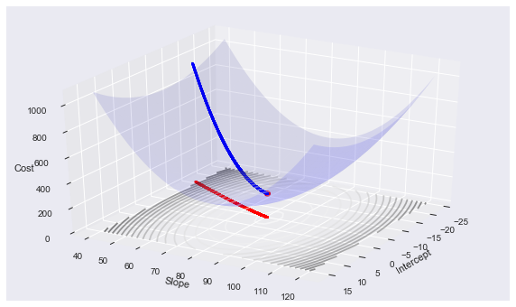

## Mean Square Error

_Mean square error is nothing but the difference between your `(actual price - predicted price)`. We square it , sum that up and divide by n. The mean square error is also known as `cost function`._
- _Here predicted price = `y = mx + b`_

$$
\text{MSE} = \frac{1}{n} \sum_{i=1}^{n} (y_i - \hat{y}_i)^2
$$

The goal of most regression algorithms is to minimize the MSE by adjusting the model parameters.

## Gradient Descent

_Gradient descent is an algorithm that finds best fit line for given tracing set._

### How to reduce MSE and get close to perfect line?

## Things we need to know

- _`Slope`_
- _`Derivative`_
- _`Partial Derivative`_
